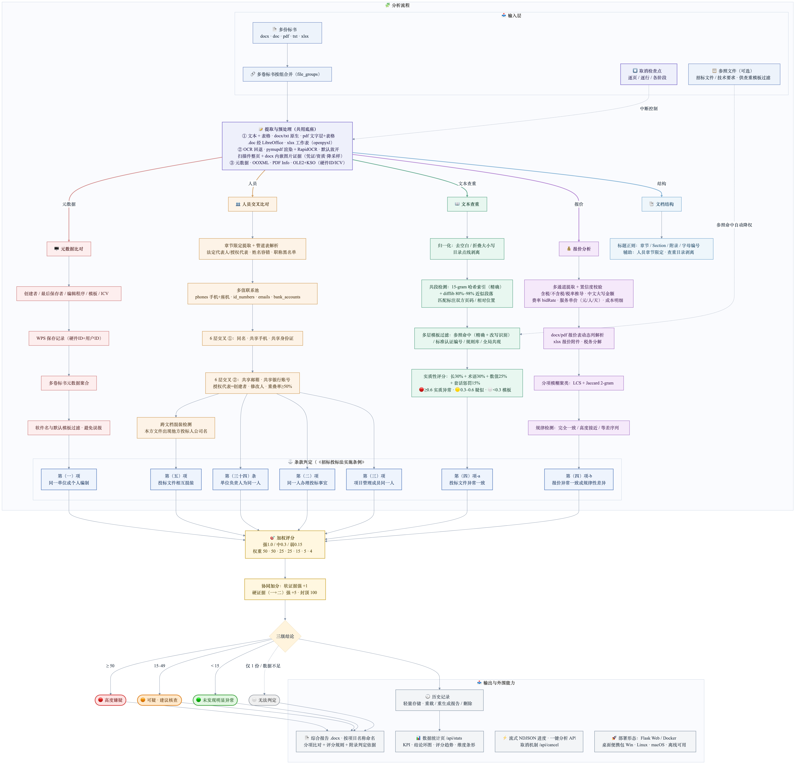

# 星易查 · 围串标风险识别分析系统（XingYiCha）

基于 Flask 的 Web 应用：上传多份投标文件，通过多维度交叉分析识别围标串标行为，
依据《中华人民共和国招标投标法实施条例》第三十四条、第四十条输出风险评分、
条款判定与 DOCX 综合报告。全流程本地运行、不依赖任何外部服务，适配内网离线环境。



> 上图：分析全链路（提取 → 五维度分析 → 条款判定 → 加权评分 → 报告输出）。
> 源文件为 [output/整体流程图mermaid.md](output/整体流程图mermaid.md)，
> 判定逻辑或条款权重变更时须同步更新。

## 功能特性

### 五维度交叉分析

| 维度 | 检测内容 |
|------|----------|
| 元数据比对 | 创建者 / 最后保存者 / 编辑程序 / 模板一致，WPS 硬件 ID 与 ICV；多卷标书聚合全部卷的元数据 |
| 文本相似度 | 15-gram 哈希索引公共段落 + 近似重复段落（捕获轻度编辑），多层模板过滤（参照精确/参照改写识别/标准认证编号/规则库/全局共现）+ 实质性四维评分；每处匹配标注双方**页码**（PDF）/ 相对位置（Word） |
| 人员比对 | 中文/英文姓名、手机/座机/身份证/邮箱/银行账号多值联系池，6 层交叉匹配 + 跨文档混装检测 |
| 报价分析 | 总价/分项/成本明细，中文大写金额解析与大小写互验，费率（bidRate）与服务单价（元/人/天 等按人头计价标书），等差数列与规律性差异检测 |
| 文档结构 | 章节标题规律比对（辅助维度） |

### 判定与评分

- **条款判定**：命中情形映射到条例条款——第（三十四）条（单位负责人为同一人）、
  第（一）项（同一单位编制）、第（二）项（同一人办理投标）、第（五）项
  （文件相互混装）、第（三）项（项目成员同一人）、第（四）项-a（文本异常一致）、
  第（四）项-b（报价规律性差异）；
- **加权评分**：条款权重 50 / 50 / 25 / 25 / 15 / 5 / 4 × 证据强度
  （强 1.0 / 中 0.3 / 弱 0.15）+ 协同加分（硬证据叠加），满分 100；
- **三档结论**：≥50 高度嫌疑 · 15–49 可疑（建议核查）· <15 未发现明显异常；
  仅 1 份文件或数据不足时输出"无法判定"。

### 其他能力

- **参照文件过滤**：可另上传招标文件 / 技术要求作为"参照"，标书间雷同段落中
  出现在参照文件里的部分自动降权，避免"大家都抄招标文件"造成的误报；
- **证据级 OCR**：扫描件 PDF 整页 OCR（pymupdf + RapidOCR，纯 CPU 推理，
  无需显卡）；docx 内嵌图片**选择性** OCR——只识别上下文表明是证据的图
  （保证金凭证、资质证书等），纯图片线索也能进入报告；
- **多卷归组**：同一投标人的多卷文件（如商务标 / 技术标）按文件名自动归组、
  合并参与比对；
- **项目名自动提取**：跨文档投票提取项目名称，报告按
  `围串标风险识别分析报告_[项目名_]判定等级_时间.docx` 命名；
- **报告输出**：概览 / 文件清单 / 四维明细（含严重度排序、人员名单、报价
  汇总与分项比对、相似段落对比表——逐条列出双方页码与评定依据）/ 条款判定
  汇总 / 证据明细 / 评分规则 / 两级处置建议 / 法条附录；
- **历史与统计**：分析记录留存，可重载、重生成报告、删除；统计页提供结论
  分布环图、评分趋势、维度命中数等；
- **流式进度与取消**：NDJSON 流式回传（逐页 OCR、逐张图片识别均可见），
  分析过程中可随时点"停止"中止；
- **文件格式**：`.docx` / `.doc` / `.pdf`（含扫描件）/ `.txt` / `.xlsx`。

## 下载与安装

桌面版免 Python、免命令行。到
[Releases 页面](https://github.com/yjiao286/xingyicha-bid-rigging-detection/releases)
（当前最新 [v2.3.0](https://github.com/yjiao286/xingyicha-bid-rigging-detection/releases/tag/v2.3.0)）
按操作系统下载对应附件：

| 操作系统 / 环境 | 下载文件 | 安装方式 | 详细指南 |
|-----------------|----------|----------|----------|
| Windows 10/11 | `XingYiCha-Setup-<版本号>.exe` | 双击安装，带卸载程序与桌面快捷方式 | [Windows部署.md](docs/Windows部署.md) |
| Windows（U盘/内网离线） | `XingYiCha-portable-<版本号>.zip` | 解压即用，双击 `星易查.exe` | 同上 |
| macOS（M1–M4 Apple Silicon） | `XingYiCha-macOS-arm64-<版本号>.dmg` | 拖入 Applications；首次打开右键→打开放行 | [macOS部署.md](docs/macOS部署.md) |
| macOS（Intel） | `XingYiCha-macOS-x86_64-<版本号>.dmg` | 同上 | 同上 |
| Linux x86_64（Ubuntu/Debian 等主流发行版） | `XingYiCha-x86_64-<版本号>.AppImage` 或 `XingYiCha-linux-x86_64-<版本号>.tar.gz` | `chmod +x` 后运行 / 解压即用 | [Linux部署.md](docs/Linux部署.md) |
| **银河麒麟 V10（x86_64：Intel/AMD/海光/兆芯）** | `XingYiCha-linux-x86_64-<版本号>.tar.gz`（推荐） | 见麒麟指南（glibc/KYLSEC/离线安装注意事项） | [银河麒麟部署.md](docs/银河麒麟部署.md) |
| **银河麒麟 V10（aarch64：飞腾/鲲鹏/麒麟990）** | 暂无预编译产物 → 源码部署 | 麒麟指南第六节 | [银河麒麟部署.md](docs/银河麒麟部署.md) |
| 服务器（任意系统） | 源码 + Docker | `docker compose up -d --build` | 仓库根目录 `docker-compose.yml` |

**通用说明**：桌面版启动后自动打开浏览器访问 `http://127.0.0.1:5001`，关闭
终端/控制台窗口即停止服务；端口占用时自动改用 5002-5010。`.docx` / `.pdf` /
`.txt` / `.xlsx` / 扫描件 OCR 均开箱即用；仅老格式 `.doc` 的**正文提取**需
系统另装 LibreOffice（免费）：Windows/macOS [官网下载](https://www.libreoffice.org/)、
macOS 亦可 `brew install --cask libreoffice`、Linux/麒麟 `sudo apt install
libreoffice`。未安装时该维度自动跳过（`.doc` 元数据比对仍可用），其余不受影响。

选机/采购前请先看 [硬件配置要求](docs/硬件配置要求.md)：OCR 为纯 CPU
推理、无需显卡，内存是第一约束——最低 2 核 / 4GB，推荐 4 核 / 8GB 起。

## 源码运行（开发 / 无预编译产物平台）

```bash
python3 -m venv venv
source venv/bin/activate        # Windows: venv\Scripts\activate
pip install -r requirements.txt
python3 app.py 5001             # 端口可省略，默认 5001；HOST=0.0.0.0 可供局域网访问
```

macOS / Linux 开发机也可直接 `./launch.sh`（自动检查占用、启动并打开浏览器）。

依赖自检（含并行提取进程池自检，覆盖桌面版冻结路径；不过只告警降级、不阻断）：

```bash
python3 app.py --check
```

## 配置项（环境变量）

全部有合理默认值，不设即可用。完整调优说明（低配机器、大扫描件场景）见
[硬件配置要求](docs/硬件配置要求.md)。

| 变量 | 默认 | 说明 |
|------|------|------|
| `DEBUG` | 关 | Flask 调试模式 |
| `MAX_CONTENT_LENGTH_MB` | 不限 | 单次上传总量上限（MB），超限返回 413 JSON 提示 |
| `OCR_MAX_PAGES` / `OCR_TIME_BUDGET` | `0`（不限） | 每份扫描件 PDF 的 OCR 页数 / 时长上限 |
| `DOCX_IMAGE_OCR` | `1` | docx 内嵌图片证据 OCR 开关 |
| `DOCX_IMAGE_OCR_MAX` / `DOCX_IMAGE_OCR_BUDGET` | `30` / `90` | 每份文件图片 OCR 张数 / 时长上限 |
| `DOCX_IMAGE_OCR_MAX_SIDE` | `2400` | 图片 OCR 前降采样长边（像素；`0` 不缩） |
| `PDF_TABLE_LAYOUT` | `auto` | PDF 表格版面分析档位：`auto` / `always` / `off` |
| `EXTRACT_CACHE` / `EXTRACT_CACHE_DIR` / `EXTRACT_CACHE_MAX_FILES` | `1` / 数据目录下 / `200` | 提取结果缓存（同一批文件二次分析秒级返回） |
| `EXTRACT_WORKERS` | 自动 | 强制指定并行提取进程数（默认按核数与内存自动定档，硬上限 16） |
| `ANALYSIS_TIMEOUT` | `3600` | 整体分析超时（秒），须小于 gunicorn timeout |
| `HOST` / `PORT` | 桌面版 `127.0.0.1`，源码 `0.0.0.0` / `5001` | 监听地址与端口（命令行首位参数亦可指定端口） |

## 开发指南

```bash
./venv/bin/python3 -c "import py_compile; py_compile.compile('app.py', doraise=True)"  # 语法检查
./venv/bin/python3 tests/test_extraction.py      # 提取回归（172 例，无 pytest 依赖）
./venv/bin/python3 tools/replay_extraction.py <语料目录>   # 批量回放文本/人员/报价提取
```

- **敏感信息守卫**：每次新克隆先执行 `sh tools/install-hooks.sh` 安装
  pre-commit / commit-msg / pre-push 三道钩子，防止真实人名、公司名、手机号、
  统一社会信用代码等泄漏进版本库（详见 [AGENTS.md](AGENTS.md) 与
  `tools/sensitive-terms.example.txt`）。
- **AI 协作规范**：架构细节、性能设计、已知坑与回归约束集中在
  [AGENTS.md](AGENTS.md)，改代码前必读。
- **发版流程**：改 `app.py` 顶部 `APP_VERSION` → 手动同步 `packaging/星易查.iss`
  与 `packaging/star.spec` 中的版本号 → 更新本 README 最新版本链接 →
  打 `v*` tag 推送（CI 自动三平台构建并发布 Release）。
- **部署源码包**：`星易查_围串标分析系统.tar.gz`（本地产物，gitignore）为
  Docker 部署用源码包，代码变更后需按 AGENTS.md 中的命令重打。

## 项目结构

```
app.py                    # 单体后端：提取 → 五维分析 → 评分 → 报告（约 8800 行）
templates/index.html      # 单页前端（分析工作台 / 数据统计两视图）
static/js/main.js         # 前端逻辑：上传、流式进度、结果渲染、统计
static/css/style.css      # 样式（图表全部手写 SVG，无 CDN 依赖）
packaging/                # 桌面版构建资产（PyInstaller spec / Inno Setup / 图标）
build/                    # 便携 Linux 包构建（可重定位 CPython + wheelhouse）
.github/workflows/        # CI：四平台矩阵构建，push v* tag 自动发 Release
docs/                     # 部署与运维文档（见下）
tools/                    # 敏感信息守卫钩子、提取回放工具
tests/                    # 提取回归测试
output/整体流程图mermaid.md  # 流程图源文件（整体流程图.png 为其渲染产物）
```

## API 一览

| 路由 | 方法 | 说明 |
|------|------|------|
| `/api/analyze_stream` | POST | 上传+分析，NDJSON 流式进度（**前端首选**），支持取消 |
| `/api/cancel` | POST | 取消进行中的分析（`{id: request_id}`） |
| `/api/upload` | POST | 仅上传文件（uuid 前缀防覆盖） |
| `/api/analyze` | POST | 对已上传文件发起分析（JSON 响应） |
| `/api/single_upload_and_analyze` | POST | 合并上传+分析（JSON 响应） |
| `/api/report` | POST | 由分析结果生成 .docx 报告 |
| `/api/history` | GET | 历史记录列表 |
| `/api/history/<id>` | GET / DELETE | 加载 / 删除指定历史记录 |
| `/api/stats` | GET | 统计页数据（结论分布、趋势、维度命中数） |
| `/api/ping` | GET | 存活探测（桌面版单实例标记） |

## 文档索引

| 文档 | 内容 |
|------|------|
| [AGENTS.md](AGENTS.md) | 架构与开发规范（AI 协作 / 深入改动前必读） |
| [docs/Windows部署.md](docs/Windows部署.md) | Windows 安装包 / 便携版获取与使用 |
| [docs/macOS部署.md](docs/macOS部署.md) | macOS dmg / zip，Apple Silicon 与 Intel |
| [docs/Linux部署.md](docs/Linux部署.md) | Linux AppImage / tar.gz |
| [docs/银河麒麟部署.md](docs/银河麒麟部署.md) | 信创环境（glibc / KYLSEC / 离线安装 / aarch64 源码部署） |
| [docs/硬件配置要求.md](docs/硬件配置要求.md) | 最低/推荐配置、OCR 资源画像、低配调优 |
| [LICENSE](LICENSE) | 自定义开源许可（商业使用须报备） |

## 开源许可

本项目采用自定义开源许可协议，全文见 [LICENSE](LICENSE)，要点：

- 个人学习、科研教学、公益活动及单位内部使用：**免费**，可自由使用、修改、
  再分发（须保留版权声明与协议全文）；
- **商业使用（销售、付费集成、有偿检测服务等）必须事先向
  中国星网易联供应链有限公司报备**，经确认后方可实施，具体授权模式以公司
  回复为准。报备邮箱：`jiaoy1@chinasatnet.com.cn`，其他渠道见
  [LICENSE](LICENSE) 第十条。

本项目含的第三方开源组件（Flask、PyMuPDF、python-docx、RapidOCR 等）遵循其
各自的开源协议。
